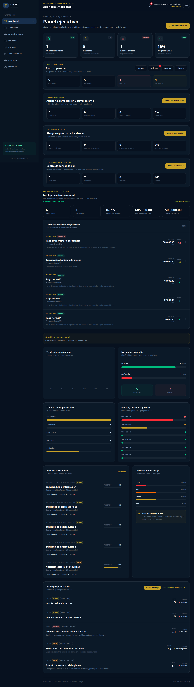
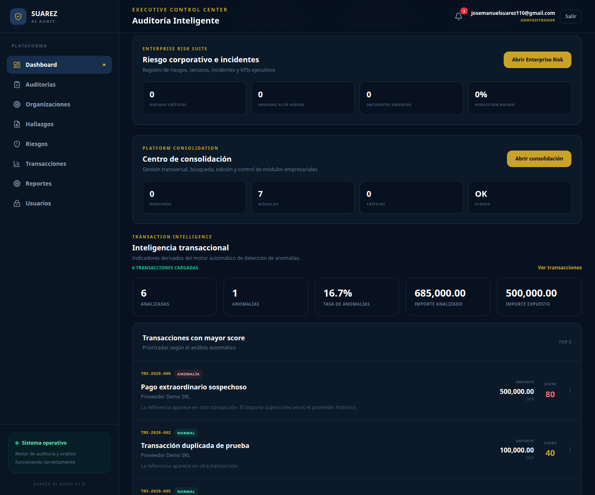
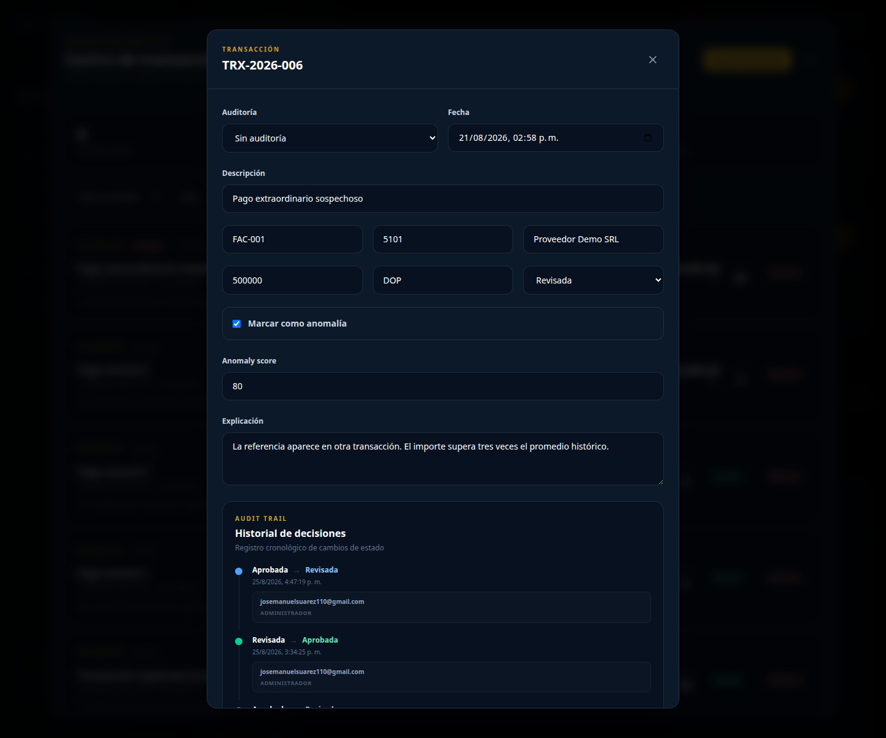
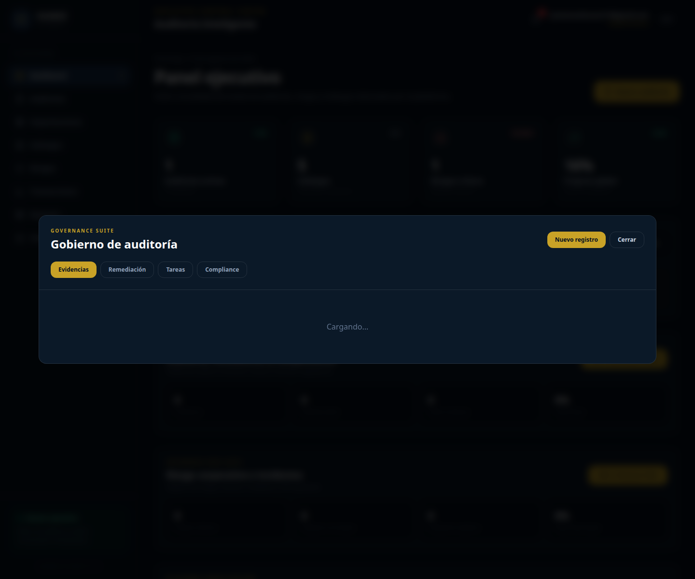
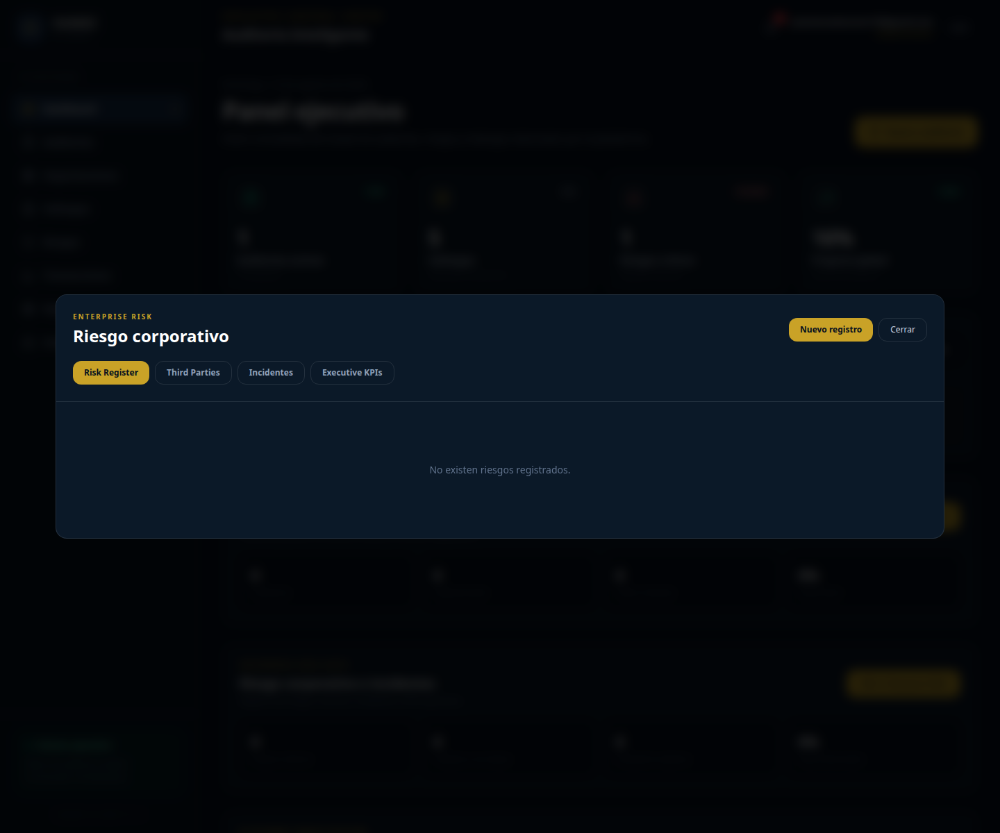
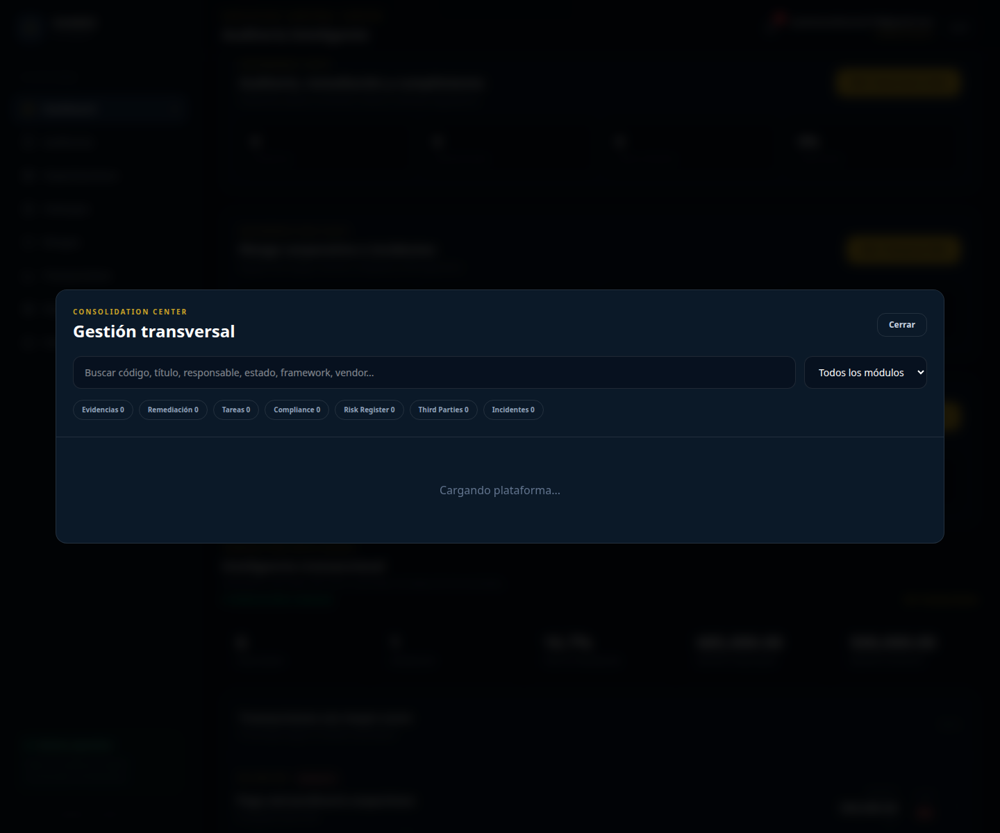

# Suarez AI Audit

[](https://github.com/josemanuelsuarez110/suarez-ai-audit/actions/workflows/ci.yml)
[](https://suarez-ai-audit.vercel.app)


Enterprise-grade intelligent auditing, risk management and transaction monitoring platform.

## Live Application

**Production:** https://suarez-ai-audit.vercel.app

## Executive Summary

Suarez AI Audit centralizes audit operations, transaction anomaly analysis, governance, enterprise risk management, compliance monitoring and executive reporting in a single web platform.

The project demonstrates end-to-end engineering across application development, PostgreSQL security, quality automation, CI/CD and production deployment.

## Core Capabilities

- Executive audit dashboard and KPI monitoring
- Transaction intelligence and anomaly scoring
- Controlled review, approval and rejection workflow
- Decision history and Audit Trail
- Audit and findings management
- Governance Suite
- Enterprise Risk Suite
- Third-party and incident monitoring
- Consolidation Center and global search
- Executive reporting and PDF export
- Role-based access control for admin, auditor and viewer roles

## Architecture

```text
Browser
  |
  v
React + TypeScript + Vite
  |
  +-- Audit Services
  +-- Transaction Services
  +-- Governance Services
  +-- Enterprise Risk Services
  +-- Reporting Services
  |
  v
Supabase
  +-- PostgreSQL
  +-- Authentication
  +-- Row Level Security
  +-- RPC Functions

GitHub -> GitHub Actions -> Vercel
                  |
                  +-- Playwright E2E
```

Detailed architecture: [docs/ARCHITECTURE.md](docs/ARCHITECTURE.md)


## Product Screenshots

### Executive Dashboard



### Transaction Intelligence



### Transaction Audit Trail



### Governance Suite



### Enterprise Risk



### Consolidation Center



## Technology Stack

| Layer | Technologies |
|---|---|
| Frontend | React, TypeScript, Vite, Tailwind CSS |
| Data | Supabase, PostgreSQL |
| Security | Supabase Auth, RBAC, Row Level Security, RPC functions |
| Testing | Playwright E2E, structural smoke checks |
| CI/CD | GitHub Actions, Vercel |
| Reporting | jsPDF, HTML rendering/export |

## Quality Engineering

Current automated E2E baseline:

```text
13 tests passed
```

Coverage includes:

- Authentication
- Executive dashboard
- Administrator RBAC
- Operations Suite
- Governance Suite
- Enterprise Risk Suite
- Consolidation Center
- Global search
- Transaction Center
- Transaction detail
- Decision history / Audit Trail

Documentation:

- [QA Strategy](docs/QA_STRATEGY.md)
- [E2E Test Matrix](docs/E2E_TEST_MATRIX.md)

## CI/CD Quality Gate

Every push to `main` is validated through GitHub Actions.

```text
Secret checks
    |
Platform smoke checks
    |
E2E structural checks
    |
TypeScript + Vite production build
    |
Bundle-size validation
    |
Authenticated Playwright E2E
```

The current GitHub Actions pipeline is green for both static quality and authenticated Playwright execution.

## Security Model

- Supabase Authentication
- Role-based access control
- PostgreSQL Row Level Security
- Database constraints for controlled states
- RPC functions for sensitive workflow transitions
- Browser-safe publishable/anon key only in the frontend
- CI and production credentials stored as environment secrets
- No service-role credentials exposed to browser code

## Transaction Review Workflow

```text
Transaction
    |
    v
Automated Analysis
    |
    +-- Normal
    |
    +-- Anomaly
          |
          v
        Review
          |
      +---+---+
      |       |
      v       v
   Approve  Reject
      |       |
      +---+---+
          |
          v
      Audit Trail
```

## Local Development

```bash
npm install
npm run dev
```

Production build:

```bash
npm run build
```

Static quality gate:

```bash
npm run quality:static
```

Full validation:

```bash
npm run quality:full
```

E2E tests:

```bash
npm run test:e2e
```

## Environment Variables

Frontend:

```text
VITE_SUPABASE_URL
VITE_SUPABASE_ANON_KEY
```

Authenticated E2E additionally requires:

```text
E2E_EMAIL
E2E_PASSWORD
```

Never expose Supabase `service_role` or `sb_secret_...` credentials in frontend code.

## Case Study

A concise engineering case study is available at [docs/CASE_STUDY.md](docs/CASE_STUDY.md).

## Production

https://suarez-ai-audit.vercel.app

## Author

**José Manuel Suárez**  
Information Systems Engineer  
JMTechLab
